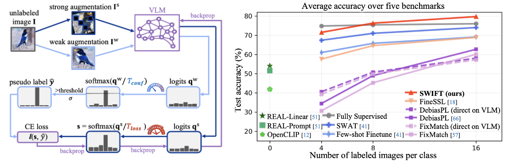

<div align="center">
<h1>Solving Semi-Supervised Few-Shot Learning<br>
from an Auto-Annotation Perspective</h1>

[**Tian Liu**](https://tian1327.github.io/)<sup>1</sup> · [**Anwesha Basu**](https://www.linkedin.com/in/anweshabasu98/)<sup>1</sup> · [**James Caverlee**](https://people.engr.tamu.edu/caverlee/index.html)<sup>1</sup> · [**Shu Kong**](https://aimerykong.github.io/)<sup>2</sup>

<sup>1</sup>Texas A&M University&emsp;&emsp;&emsp;<sup>2</sup>University of Macau
<br>

<a href="https://arxiv.org/abs/2512.10244"></a>
<a href='https://tian1327.github.io/SWIFT/'></a>
</div>


We investigate the failures of representative semi-supervised learning methods, e.g., FixMatch and DebiasPL, in the challenging few-shot setup for finetuning a pretrained VLM. Our analyses reveal the root cause in the rather ''flat'' softmax probabilities from contrastively pretrained VLMs, which leads to weak supervision and zero utilization of pseudo-labeled data. 

To address this, we propose simple-yet-effective remedies, including classifier initialization and temperature tuning. Building upon these insights, our final method SWIFT effectively finetunes a VLM on limited labeled data, abundant unlabeled data, and task-relevant retrieved data. SWIFT outperforms recent FSL and SSL methods by 5% accuracy across five benchmarks, even rivalling fully supervised finetuning with all labels.

<div align="center">


</div>

## News

- **2025-12-30:** SWIFT code is released.
- **2025-12-11:** arXiv preprint is published.

### Preprare Env and Datasets
Create conda environment and install dependencies following the instructions in [ENV.md](./ENV.md).

Prepare the datasets following the instructions in [DATASETS.md](./DATASETS.md).

Retrieve relevant pretraining data following the instructions in [RETRIEVAL.md](./RETRIEVAL.md).


### Code Usage

To run SWIFT:

```bash
# first run linear probing on few-shot data to initialize classifier
bash scripts/run_dataset_seed_probing.sh semi-aves 1

# then run stage 2 and 3 training with the initialized classifier
bash scripts/run_dataset_seed_swift.sh semi-aves 1
```

To run FS-FT:

```bash
# run FS-FT with text-initialized classifier
bash scripts/run_dataset_seed_FSFT_text-init.sh semi-aves 1
```

To run FixMatch and DebiasPL baselines:

```bash
# run for a single dataset
bash scripts/run_dataset_seed_fixmatch.sh semi-aves 1
bash scripts/run_dataset_seed_debiasPL.sh semi-aves 1
```

To run fully supervised references:

```bash
# w/o RA
bash scripts/run_dataset_seed_oracle1.sh semi-aves 1

# w/ RA
bash scripts/run_dataset_seed_oracle2.sh semi-aves 1
```


## Related Works

Check out our related works below:

- [POC](https://tian1327.github.io/POC/) (arXiv 2025): harnessing large multimodal models for few-shot visual species recognition
- [SWIFT](https://tian1327.github.io/SWIFT/) (arXiv 2025): enabling successful semi-supervised learning with VLM
- [VEST](https://hannawang09.github.io/projects/vest/) (arXiv 2025): retrieving open data for validation in few-shot learning
- [SWAT](https://tian1327.github.io/SWAT/) (CVPR 2025): retrieving open data for few-shot finetuning a VLM
- [REAL](https://shubhamprshr27.github.io/neglected-tails-of-vlms/) (CVPR 2024): uncovering the failures and causes in zero-shot VLMs

## Citations

If you find our project useful, please consider citing our works:

```bibtex
@article{liu2025swift,
title={Solving Semi-Supervised Few-Shot Learning from an Auto-Annotation Perspective}, 
author={Liu, Tian and Basu, Anwesha and Kong, Shu},
journal={arXiv preprint arXiv:2512.10244},
year={2025}
}

@article{liu2025poc,
title={Surely Large Multimodal Models (Don’t) Excel in Visual Species Recognition?}, 
author={Liu, Tian and Basu, Anwesha and Kong, Shu},
journal={arXiv preprint arXiv:2512.15748},
year={2025}
}

@article{wang2025enabling,
title={Enabling Validation for Robust Few-Shot Recognition}, 
author={Wang, Hanxin and Liu, Tian and Kong, Shu},
journal={arXiv preprint arXiv:2506.04713},
year={2025}
}

@inproceedings{liu2025few,
    title={Few-Shot Recognition via Stage-Wise Retrieval-Augmented Finetuning},
    author={Liu, Tian and Zhang, Huixin and Parashar, Shubham and Kong, Shu},
    booktitle={Proceedings of the IEEE/CVF Conference on Computer Vision and Pattern Recognition (CVPR)},
    year={2025}
}

@inproceedings{parashar2024neglected,
    title={The Neglected Tails in Vision-Language Models},
    author={Parashar, Shubham and Lin, Zhiqiu and Liu, Tian and Dong, Xiangjue and Li, Yanan and Ramanan, Deva and Caverlee, James and Kong, Shu},
    booktitle={Proceedings of the IEEE/CVF Conference on Computer Vision and Pattern Recognition (CVPR)},
    year={2024}
}
```
